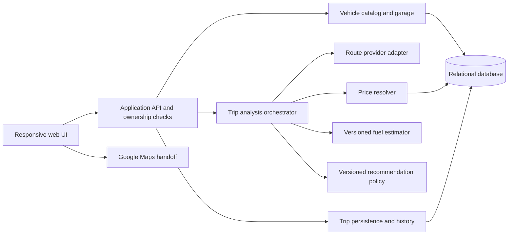

# Proposed architecture

Use one modular web application with a relational database and replaceable data-provider adapters. This keeps the thesis deployable and makes each calculation inspectable. The concrete framework, authentication library, database product and host are M1 choices, not commitments made by this foundation.

## Components and responsibilities

The fixture adapters and later external providers satisfy the same contracts. A runtime LLM is unnecessary for arithmetic, route comparison or the first demo; explanations come from recorded reasons. Development agents are not runtime application components.

## Modules

| Module | Owns | Boundary |
|---|---|---|
| Account | Session and user identity | Server obtains user identity; client-supplied owner IDs are not authoritative |
| Vehicle catalog / garage | Sourced variants, user vehicles, defaults | Unknown specifications remain unknown; manual entries have distinct provenance |
| Location resolver | Explicitly resolved origin and destination | Typed coordinates and labels; text alone cannot start analysis |
| Routing | Route identifiers, metrics, preview and traffic metadata | Returns available routes; zero or one is a valid provider outcome |
| Price resolver | Brand/type/grade/location compatibility and specificity | Only usable observations participate; selection policy and freshness are versioned |
| Fuel estimator | Per-route expected liters and optional range | Supports fixture/unvalidated/validated provenance; method remains replaceable |
| Recommendation | Eligible routes, selected recommendation and explanation | Fixture policy initially; no silent final fuel/time score |
| Analysis orchestrator | Input snapshot, provider composition, calculation and expiry | Pure cost calculation independent of brand-based liter changes |
| Trip store | Planned trip, selected vs recommended route, history and user response | Idempotent creation; original analysis values preserved where storage is permitted |
| Handoff builder | Encoded Maps URL using permitted input fields | Handoff request is not evidence of travel; exact route match not guaranteed |

## Analysis sequence

1. Authenticate; validate ownership of the selected saved vehicle, resolved endpoints and compatible fuel selection.
2. Snapshot inputs and their version. Retrieve routes and applicable prices concurrently where independent; apply bounded timeouts.
3. Estimate fuel for eligible routes using the chosen estimator adapter. Derive costs from the same quote for fair route comparison, unless a future explicitly approved station-specific policy changes this.
4. Apply the versioned recommendation policy. If data are inadequate for a fuel-based recommendation, return an explicit unavailable recommendation instead of inventing one.
5. Return an expiring analysis with provenance, warnings and route results. Store transient provider content only as allowed. Input edits invalidate the active result and require reanalysis.
6. On handoff selection, POST the analysis ID, selected route ID and idempotency key. The server validates selection, analysis age and ownership and creates/reuses one planned trip in a transaction.
7. Return the saved trip ID and Maps URL. The browser opens Maps only after save success. If opening fails, retain the saved trip and offer a retry link.

## Persistence design

Core relations: users, catalog_variants, saved_vehicles, fuel_price_observations, planned_trips, trip_route_snapshots, fuel_measurements. Analysis cache is optional, bounded and separate from durable history. IDs and foreign keys must not impose a small catalog or history limit. Index owner/date for history and normalized brand/model/year for vehicle search; paginate the full history.

User-owned inputs and independently authored fixture results may be retained for the prototype. External geometry, metrics, route names and derived results require a field-by-field retention matrix before live persistence (D14). The design does not presume that storing derived values evades provider terms. If history requirements conflict with a provider, choose a permitted source or explicitly revise the live-history scope; do not silently remove required fields.

Vehicle and price snapshot data do not change when a catalog entry or current quote changes. Retention rules may require expiry/removal; show a historical-unavailable state instead of substituting newly calculated values. This exception must be documented per field.

## Failure and cost control

Preserve user inputs on failures. Return structured errors and partial results only when each missing field is explicit. No background retry loop, unbounded provider requests, or invented fallback data. Cache static catalog data; cache external content only where permitted. Reuse the selected quote across route costs. Limit automatic retries to transient failures with a bounded policy defined in M1. Set per-account/request limits before live integration.

Record request count, adapter latency, failure class, method version and coverage; exclude precise locations from routine logs. Measure before adding infrastructure. M2 has a proposed fixture timing target; M3 sets live targets based on evidence and school budget.

## Research boundary

The estimator interface is stable; internal features and algorithms are deferred. Research exports require consent and acquisition rights and must exclude unverified labels by default. Store measurement provenance and later protocol/version separately from user history. A working application is evidence of workflow functionality only.
